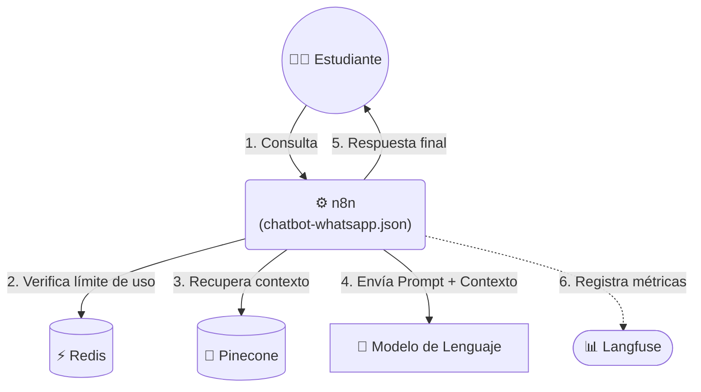

# Chatbot FAMAF

<p align="center">
   
</p>

Este repositorio contiene la implementación de un **asistente para WhatsApp** diseñado para atender consultas frecuentes de la comunidad de la **Facultad de Matemática, Astronomía, Física y Computación (FAMAF)** de la **Universidad Nacional de Córdoba**.

<p align="center">
  <a href="https://wa.me/5493513769490?text=Hola!%20Tengo%20una%20consulta%20sobre%20FAMAF" target="_blank">
    
  </a>
</p>

## ℹ️ Descripción del Proyecto
El sistema despliega un Agente basado en Recuperación de Información que resuelve consultas sobre trámites, materias y vida académica utilizando respuestas predefinidas, eliminando el riesgo de alucinaciones.

### Características Principales:
* **Arquitectura de Recuperación:** utilizar búsqueda vectorial para contrastar las consultas de los usuarios con una base de conocimiento curada (información extraída de sitios oficiales y redes sociales de la institución).
* **Almacenamiento y Búsqueda de Vectores:** implementa índices de **Pinecone** para almacenar los *embeddings* de la base de conocimiento y utilizar su motor para la recuperación semántica de información.
* **Automatización de Procesos:** flujos de trabajo en **n8n** para actualizar la base de conocimiento del agente y responder las consultas entrantes.
* **Observabilidad:** registrar y trazar cada interacción en **Langfuse** para monitorear el comportamiento del agente en tiempo real.
* **Panel de Administración:** proveer una interfaz web para gestionar el conocimiento del bot de manera accesible.

## ⚙️ Arquitectura del Sistema



La arquitectura del sistema se divide en componentes. Para introducir estos componentes y comprender el funcionamiento del sistema, a continuación se describen brevemente los procesos siguiendo el ciclo de vida de la información:

* **n8n:** es el encargado de que todos los componentes se comuniquen entre sí. Recibe las consultas de los estudiantes a través de la _WhatsApp Business API_, realiza las búsquedas de información en Pinecone, transfiere la información recuperada al modelo de lenguaje y le responde al usuario.
* **Pinecone:** es el espacio donde se almacena el conocimiento del chatbot. Funciona como la base de datos vectorial que guarda las preguntas frecuentes procesadas en forma de vectores con su respuesta como metadato. Esto permite realizar búsquedas semánticas de manera eficiente para encontrar las consultas más similares a la que realizó el estudiante, otorgando el contexto que el modelo necesita antes de decidir la respuesta.
* **Redis:** es una base de datos de alta velocidad utilizada para llevar la cuenta de cuántas preguntas hace cada usuario en un intervalo determinado, la cual se consulta antes de procesar la respuesta. Guarda el identificador de la persona junto con su número de consultas para evitar abusos y asegurar que el sistema no se sature.
* **Langfuse:** en producción, se encarga de registrar cada interacción entre los estudiantes y el agente, almacenando la consulta, la respuesta y la latencia. Pero además, es una herramienta muy útil para evaluar las arquitecturas y los modelos con los workflows presentes en `evaluation/`, permitiendo analizar el consumo de tokens, calcular métricas y detectar errores.
* **Panel de Administrador:** es una interfaz web pensada para gestionar la base de conocimiento del sistema. Permite actualizar o cargar nueva información de forma manual o masiva utilizando archivos `.csv`, además de revisar las preguntas que ya forman parte del conocimiento del agente.

## 📖 Guía de Instalación

Levantar el ecosistema completo requiere configurar las variables de entorno, iniciar los contenedores de Docker y conectar los servicios mediante n8n. Por este motivo, podés **consultar la Wiki del proyecto** para encontrar las descripciones de las variables de entorno y seguir las instrucciones detalladas para desplegarlo en el entorno local.

👉 [Ver las instrucciones de instalación paso a paso en la Wiki](https://github.com/mit0110/chatbot_famaf/wiki)

## 🛠️ Requisitos previos
Para desplegar el ecosistema (n8n, Redis, Langfuse, Panel de Administrador), es necesario contar con una serie de servicios interconectados mediante Docker.

**Herramientas necesarias:**
* **Docker y Docker Compose:** para levantar todos los contenedores del sistema.
* **Git:** para clonar el repositorio y gestionar las versiones del proyecto.

**Credenciales y API Keys:** Una vez desplegado el proyecto, **ingresar** a n8n y **configurar** las credenciales requeridas:
* **Pinecone**: para buscar e insertar datos en la base de conocimiento, obtener:
   * Una cuenta en [Pinecone](https://app.pinecone.io/) para generar una *API KEY* y acceder a la base de datos vectorial.
* **WhatsApp**: para enviar y recibir mensajes usando la *WhatsApp Business API*, conseguir:
   * Un portafolio comercial en [Meta for Business](https://business.facebook.com/).
   * Una cuenta de desarrollador en [Meta for Developers](https://developers.facebook.com/).
   * Una aplicación con el caso de uso "Conectarte con los clientes a través de WhatsApp" asociada al portafolio comercial para:
     * *Identificador* y *Clave Secreta* de la app para recibir los mensajes.
     * *Business Account ID* y *Token Permanente* con control total sobre la app para enviar mensajes.
* **Google Gemini API**: para consumir los modelos de Google (modelos de *embeddings* y LLMs), crear:
  * Una cuenta en [Google AI Studio](https://aistudio.google.com/) con un proyecto activo.
  * Una *API KEY* asociada al proyecto.
* **Langfuse**: para registrar datos desde n8n (ya sea en su versión web o self-hosted), generar:
   * *Public Key* y *Secret Key* asociadas a un proyecto.
* **Redis**: para consultar los límites de cada usuario, crear:
  * Una base de datos creada dentro de Redis que proporcione:
      * *Contraseña* de acceso.
      * *Host* y *Puerto*.
* **Ollama CCAD (Opcional)**: para usar modelos del Centro de Computación de Alto Desempeño (CCAD) de la Universidad Nacional de Córdoba, **solicitar**:
  * Acceso a [chat.ccad.unc.edu.ar](https://chat.ccad.unc.edu.ar/) para generar una *API KEY*.
* **Telegram (Opcional)**: para recibir y enviar mensajes vía Telegram, **crear**:
   * Una cuenta de Telegram y un bot utilizando [Bot Father](https://telegram.me/BotFather).
   * Un *Token de acceso* vinculado al bot.

## 📂 Estructura del repositorio
La organización de las carpetas dentro del proyecto es la siguiente:

```text
├── admin_panel/
├── data/
├── infra/
├── notebooks/
└── workflows/
    ├── canned_responses/
    ├── rag/
    └── evaluation/
```

* **`admin_panel/`**: contiene el código de la interfaz web para gestionar la base de conocimiento del bot.
* **`data/`**: almacena las bases de conocimiento y los conjuntos de datos utilizados durante el desarrollo y la evaluación del chatbot.
* **`infra/`**: agrupa todo lo relacionado con la infraestructura y el despliegue del ecosistema (archivo Docker Compose y `.env` de ejemplo para su configuración).
* **`notebooks/`**: incluye los *Jupyter Notebooks* utilizados para calcular métricas, evaluar resultados y analizar el comportamiento del sistema.
* **`workflows/`**: contiene todos los flujos exportados de n8n que implementan la lógica del sistema, divididos según su propósito:
  * **`canned_responses/`**: arquitectura de un chatbot con respuestas predefinidas (**versión de producción**).
  * **`rag/`**: flujos que implementan una arquitectura RAG (Retrieval-Augmented Generation) en una versión experimental.
  * **`evaluation/`**: flujos creados para automatizar la evaluación y calcular métricas de las distintas versiones del chatbot que se desarrollaron a lo largo del proyecto.