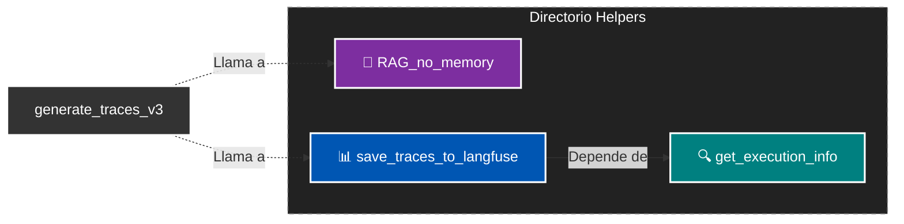

# 🛠️ Workflows Auxiliares (Helpers)

Este directorio contiene **sub-workflows** útiles diseñados para ser llamados por los flujos principales de trabajo.

Su función es encapsular la lógica de workflows principales para mantener el workflow padre principal limpio y legible.

## 📂 Contenido del Directorio

### 1. 🧠 `RAG_no_memory`
Este sub-workflow es un Agente RAG sin memoria, es decir, no guarda mensajes anteriores (historial) del usuario, sino que recibe un input y decide la respuesta.
* **Entrada:** Query del usuario + Documentos recuperados.
* **Objetivo:** Evalúa la relevancia del contexto y detecta casos sensibles.
* **Uso:** Se invoca en el workflow padre después de realizar la búsqueda vectorial.

### 2. 📊 `save_traces_to_langfuse`
Un sub-workflow que se llama para enviar métricas a **Langfuse** (MLOps).
* **Objetivo:** Formatear correctamente los datos para cumplir con el estándar **OpenTelemetry (OTLP)** y enviar a Langfuse (Servidor de Observabilidad).
* **Características:** Vincula la ejecución con datasets de prueba, registra latencias y tokens usados por los modelos.
* **Dependencia:** Llama internamente a `get_execution_info` para obtener el modelo y tokens usados.

### 3. 🔍 `get_execution_info` (Utilidad Interna)
Un workflow de utilidad que interactúa con la API de n8n.
* **Objetivo:** Extraer metadatos de la ejecución (tokens consumidos, modelos usados) que no están disponibles en el contexto estándar del workflow para el número de ejecución que se le suministró.
* **Compatibilidad:** Normaliza la salida de tokens para proveedores Google Gemini y Ollama.

---

## 🔄 Flujo de Dependencias

Estos helpers están diseñados para trabajar en cadena. El siguiente esquema muestra cómo se relacionan entre sí dentro de este directorio:

